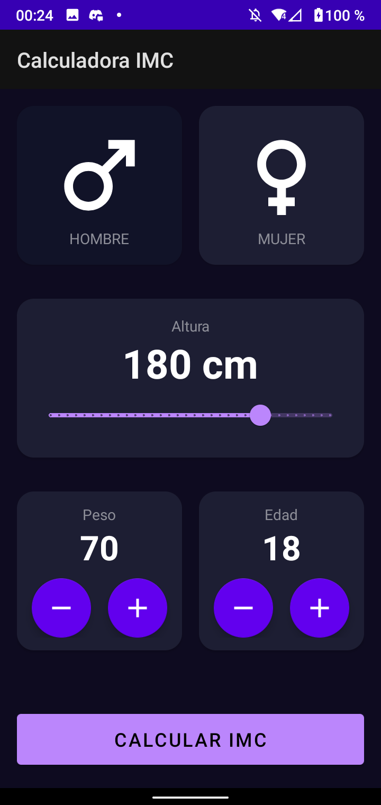

# IMC Calculator

Esta aplicación te permite calcular el indice de masa corporal, este es un número que se calcula basandose en el peso y estatura, se usa como identificador de las categorías de peso que hay.

Elementos utilizados en esta aplicación:
* Cambios de pantallas con Intents
* Gestión, utilización y creación de recursos(string, color)
* Diseño de UI
* RangeSlider
* CardView

|                               Pantalla principal                               |                                   Resultado                                    |
|:------------------------------------------------------------------------------:|:------------------------------------------------------------------------------:|
|    |    |